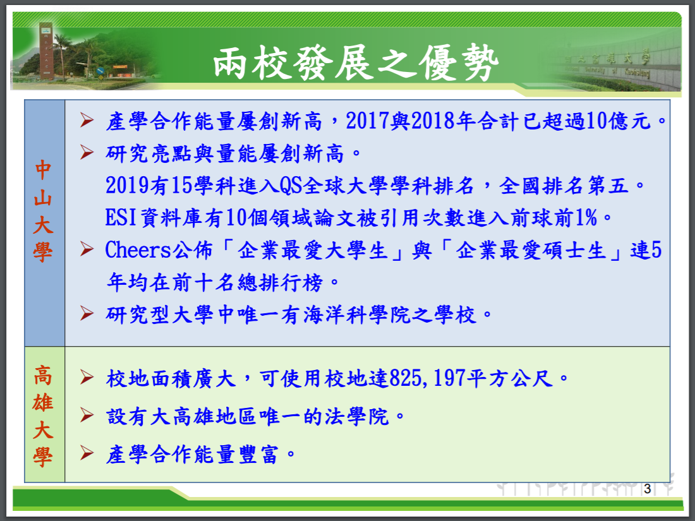
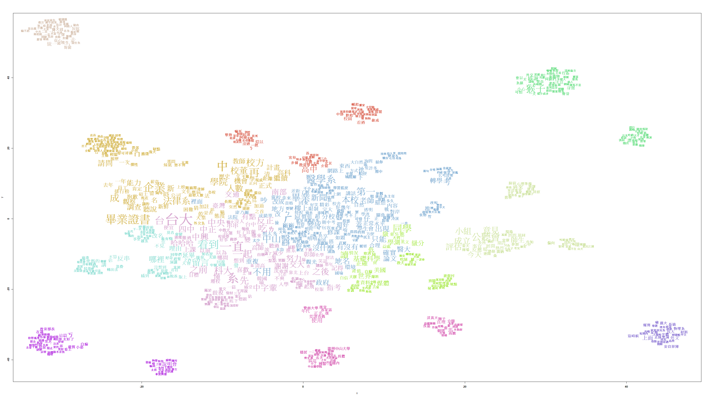

## 一、文獻探討
- 在進行資料分析前，我們先介紹一下中山與高大併校的相關論點。

- 併校背景: 高等教育深耕計畫的競爭趨勢



- 上圖可以看到兩校的優勢，中山有著豐富的產學合作績效以及漂亮的學科與企業最愛學生排名，而且在研究型大學中唯一一個有海洋科學院；高大則校地面積廣大，而且有高雄地區唯一一間的法學院。


- 接下來是兩校的劣勢，可以看到中山相反地校地小，而且教師世代交替影響研究能量；高大資源不足、研究生人數少。兩校規模都小，不利國際競爭。


- 從這三張圖可以看不論是在學生、教師或是行政人員人數，中山都比高大多很多，人力資源上中山較優渥，而且 從上圖來看，中山的研究所學生數為4699，高大研究所為1288，兩者相差3.6倍，反映出中山的定位是研究型大學，高大則是教學型大學。

另外可以看到其實兩校重疊的學院不少，只有海科學院及法學院是沒有重疊的


- 中山屬於邁向頂尖大學計畫的12校之一，而且高等教育深耕計畫拿到的補助也是高醫的兩倍多，加上入學學生人數較多，因此中山的各項財政收入明顯高於高大


- 可以看到中山面積雖然有73公頃，但是有6成的土地是山坡地無法使用，反觀高大有足足82公頃，而且全部皆可使用，可用校地面積廣大，這是高大有而中山沒有的優勢之處。
但是在助學金上中山因為財政較佳(從上張圖可以看到)，所以提供給學生的助學金較優渥。

- 綜合以上幾個論點，可以得知兩校相比，中山的優勢在人數、資金與國際聲望；高大則在於可用校地與法學院。


- 可以看到兩校合併後校地可以大過台、清、交+陽，而且雖然其他數據還是比這四間還低，但是仍然提升不少


- 合校後面臨的問題，有很多個面向，包括組織、法規、教師、職員工、學生、空間、國際聲望、校名等等，我們選幾個來說明

- 1.組織:


- 即使兩校的系所有很多是相同的，但在整合上仍需要考慮如何分配教師、學生數量、經費及空間規劃，不同系所間也要考慮到以變動性最小且要有互補性的方式去執行。


- 2.空間:


- 多了高大的土地空間，高大的校區可以規劃成「高雄創新科技基地」，以及新建教研大樓，還有貴重儀器的搬遷等等，這些成本與設計都需要去仔細評估與考量。


- 3.校名與國際聲望:


- 兩校合併後該改成甚麼名字，中山考慮到如果以學術聲望的QS世界大學排名來看，在國際上「中山」已成功建立了學校品牌，如果改名恐造成學校的聲望下降，而且管理學院原本的國際認證都將化為烏有，所以應該以「中山」作為兩校合併後的名字，但是實際名字仍需要與高大協商以及教育部核准。

- 小結: 從以上這些副校長針對兩校所評估的優劣勢以及併校後會面臨的問題，可以看到其實副校長對於兩校合併是表示支持的，雖然兩校科系重複多，但是併校後中山可以有法學院而且校地資源變豐富，優點其實是大於缺點的。但是從以上文獻只能說明校方想要與高大合併的看法與論點，而兩校學生的意見也是很重要的，因為不論是在科系、學院規劃，或是畢業證書等等，對學生影響都很重大，所以我們想要知道兩校學生對併校議題的看法與情緒，因此要對社群媒體上學生寫的留言與文章做文字探勘分析。


- 參考資料來源:中山大學與高雄大學合校評估:https://drive.google.com/file/d/1rypWsul5Xxa7hdHci2Wrs9ObCLw8zySv/view?fbclid=IwAR18a35VJ1t2AL9ubRugi2Z2NQfuFiGP2OYOxnVosGiyDA2AwMn_M9Dze8I

## 二、動機和分析目的
- 近期中山大學校方與高雄大學校方積極在討論併校的議題，因為我們有一股中山魂，因此想瞭解學校的議題，即使快要畢業，但是併校此議題對於身為中山大學學生的我們影響依舊很大，而且會影響學弟妹的未來，所以想做關於併校議題的分析。我們透過分析得知網路上各種來源(ptt、Dcard的高大板、中山板、考試板)的看法，進而歸納出結論。由於網路上資料大部分為學生所張貼的內容，因此分析結果可能偏向為學生對於併校議題的看法。

## 三、資料集的描述
- 從網路來源──Dcard、ptt、facebook、蘋果日報，三個來源來分析，但是我們發現facebook的中山大學社團中山大小事，討論的文章沒有明顯的留言討論，僅有互相tag，所以我們就沒有將facebook的資料進行分析，而蘋果日報的部分由於是討論併校的新聞較少，這部分也不做分析，最後我們取dcard中山板、dcard高大板、dcard考試板、ptt八卦板的資料進行分析。
dcard中山板、dcard高大板、dcard考試板各1000篇 約到去年10月
ptt八卦板 去年10月到2019/4/19
進行篩選後，總共有 30篇dcard中山板的文、34篇高大板的文章、13篇考試板的文章、20篇ptt板的文章

## 四、資料的分析過程、結果與解釋
### 系統設置
```{r}
Sys.setlocale("LC_CTYPE", "cht")
```


### 準備所需要的library
```{r message=FALSE, warning=FALSE}
 packages = c("dplyr", "tidytext", "stringr", "wordcloud2","tidyverse",'knitr','kableExtra','NLP', "ggplot2",'readr','data.table','reshape2','tidyr','scales','jiebaR','htmltools',"ggraph", "igraph", "reshape2", "widyr","gtools","tm","quanteda","Matrix","slam","Rtsne","randomcoloR","magrittr","topicmodels","LDAvis","webshot","htmlwidgets","servr","doParallel")
 existing = as.character(installed.packages()[,1])
 for(pkg in packages[!(packages %in% existing)]) install.packages(pkg)
```
### 載入 library
```{r message=FALSE, warning=FALSE} 
library(dplyr)
library(stringr)
require(tidytext)
library(wordcloud2)
require(data.table)
require(ggplot2)
require(reshape2)
require(tidyr)
require(readr)
require(scales)
library(jiebaR)
library(tidyverse)
library(knitr)
library(kableExtra)
library(NLP)
library(ggraph)
library(igraph)
library(reshape2)
library(widyr)
library(gtools)
library(htmltools)

require(tm)
require(quanteda)
require(Matrix)
require(slam)
require(Rtsne)
require(randomcoloR)

require(magrittr)
require(topicmodels)
require(LDAvis)
require(webshot)
require(htmlwidgets)
require(servr)
```

### 載入文章及留言
- 資料來源:
  - dcard中山板、dcard高大板、dcard考試板各1000篇 約到去年10月
  - ptt八卦板 去年10月到2019/4/19
  - 分為文章以及留言，留言為過濾完的文章後的留言
```{r}

nsysu_data = fread("data/my_csv_nsysu.csv",encoding = 'UTF-8')
nuk_data =fread("data/my_csv_nuk.csv",encoding = 'UTF-8')
exam_data =fread("data/my_csv_exam.csv",encoding = 'UTF-8')
ptt_data =fread("data/ptt.csv",encoding = 'UTF-8')
nsysu_comment =fread("data/comment_nsysu.csv",encoding = 'UTF-8') #552
nuk_comment =fread("data/comment_nuk.csv",encoding = 'UTF-8') #818
ptt_comment =fread("data/comment_ptt.csv",encoding = 'UTF-8') #1024
exam_comment =fread("data/comment_exam.csv",encoding = 'UTF-8') #1024
```

### 整理文章資料
```{r}
#過濾有出現關於併校資訊關鍵字的文章，並且將增加來源的欄位
nsysu_data = nsysu_data %>%
  filter(grepl("高大|併校|合併|合校|高雄大學|公聽會",content)|grepl("高大|併校|合併|合校|高雄大學|公聽會",title))%>%
  mutate(source = "nsysu_dcard")
nuk_data = nuk_data %>%
   filter(grepl("中山|併校|合併|合校|中山大學|公聽會",content)|grepl("中山|併校|合併|合校|中山大學|公聽會",title)) %>%
   filter(!(grepl("愛滋",content)|grepl("愛滋",title))) %>%
   mutate(source = "nuk_dcard")
exam_data = exam_data %>%
   filter(grepl("併校|合併|合校|公聽會",content)|grepl("併校|合併|合校|公聽會",title)) %>%
   filter(grepl("高大|中山|高雄大學",content)|grepl("高大|中山|高雄大學",title)) %>%
  mutate(source = "exam_dcard")
ptt_data = ptt_data %>%
   filter(grepl("併校|合併|合校|公聽會",artTitle)|grepl("併校|合併|合校|公聽會",artContent)) %>%
   filter(grepl("高大|中山|高雄大學",artTitle)|grepl("高大|中山|高雄大學",artContent)) %>%
   filter(!(grepl("山手線|賽馬|手線|高雄縣市合併|又老又窮|清大或交大合校",artTitle)|grepl("山手線|賽馬|手線|大甲",artContent))) %>% 
  mutate(source = "ptt")
#將ptt的資料_id 改成統一的id
colnames(ptt_data)[which(names(ptt_data) == "_id")] <- "id"
```
- 總共有 30篇dcard中山板的文、34篇高大板的文章、13篇考試板的文章、20篇ptt板的文章

### 將文章資料合在一起
```{r}
#透過rbind將文章資料合起來
article = nsysu_data %>%
   select(id,createdAt ,source ,title,content)%>% 
   rbind(nuk_data %>% select(id,createdAt ,source ,title,content))%>%
   rbind(exam_data %>% select(id,createdAt ,source ,title,content))
colname = c("id", "artDate","source","artTitle","artContent")
colnames(article) <- colname
article = article %>%
  rbind(ptt_data %>% select(id,artDate ,source ,artTitle,artContent))
article$artDate = as.Date(article$artDate)
kable(article) %>% 
  kable_styling(bootstrap_options = c("striped", "hover")) %>% 
  scroll_box(height = "300px")
```


### 整理留言資料
- 留言資料為過濾完的文章資料下面的留言
```{r}
nsysu_comment = nsysu_comment %>%
  filter(nchar(nsysu_comment$content)>5)%>% 
  mutate(source="nsysu_dcard")
 nuk_comment = nuk_comment %>%
  filter(nchar(nuk_comment$content)>5)%>% 
   mutate(source="nuk_dcard")
 exam_comment = exam_comment %>%
  filter(nchar(exam_comment$content)>5)%>% 
  mutate(source="exam_dcard")
ptt_comment = ptt_comment %>%
  filter(nchar(ptt_comment$content)>5)%>% 
  mutate(source="ptt")
```

### 將留言資料合在一起
```{r}
comment = nsysu_comment %>%
   select(id,Date ,source ,source,content)%>% 
   rbind(nuk_comment %>% select(id,Date ,source ,content))%>%
  rbind(exam_comment %>% select(id,Date ,source ,content))
comment =comment %>%
  rbind(ptt_comment %>% select(id,Date ,source ,source,content))
colname = c("id", "artDate","source","artContent")
colnames(comment) <- colname
comment$artDate = as.Date(comment$artDate)
comment <- comment %>% 
  filter(id %in% article$id)
kable(comment) %>% 
  kable_styling(bootstrap_options = c("striped", "hover")) %>% 
  scroll_box(height = "300px")
```

### 將留言資料和文章資料合起來
```{r}
data = article%>%
  smartbind(comment)
kable(data) %>% 
  kable_styling(bootstrap_options = c("striped", "hover")) %>% 
  scroll_box(height = "300px")
```


### 以日期計算文章數
```{r}
data_count_by_date <- data %>% 
  group_by(artDate,source) %>% 
  summarise(count = n()) %>% 
  arrange(desc(count))

kable(head(data_count_by_date, 20)) %>% 
  kable_styling(bootstrap_options = c("striped", "hover")) %>% 
  scroll_box(height = "300px")

```

### 畫出日期以及文章分布折線圖 
```{r message=FALSE, warning=FALSE}
plot_date <- 
  data_count_by_date %>% 
  ggplot(aes(x = as.Date(artDate), y = count,colour=source)) +
  geom_line(size = 0.5) + 
  # geom_vline(xintercept = as.numeric(as.Date("2019-03-30")), col='red') + 
  scale_x_date(labels = date_format("%Y/%m/%d" )) +
  ggtitle("高大與中山併校 討論文章數") + 
  xlab("日期") + 
  ylab("數量") + 
  theme(text = element_text(family = "Heiti TC Light")) #加入中文字型設定，避免中文字顯示錯誤。

plot_date
```

- 可以看到在三月底四月初時，有明顯熱烈討論的現象，因當時中山大學校方正在積極與高雄大學討論合併的事情，同時也展開公聽會等，讓大家可以更了解併校

### 增加結巴字典以及正規化function已得到tokens
```{r}
jieba_tokenizer <- worker(user="dict/user_dict.txt", stop_word = "dict/stop_words.txt")
clean = function(txt) {
  txt = gsub("B\\w+", "", txt) #去除@或#後有數字,字母,底線 (標記人名或hashtag)
  txt = gsub("(http|https)://.*", "", txt) #去除網址
  txt = gsub("[ \t]{2,}", "", txt) #去除兩個以上空格或tab
  txt = gsub("\\n"," ",txt) #去除換行
  txt = gsub("\\s+"," ",txt) #去除一個或多個空格
  txt = gsub("^\\s+|\\s+$","",txt) #去除前後一個或多個空格
  txt = gsub("&.*;","",txt) #去除html特殊字元編碼
  txt = gsub("[a-zA-Z0-9?!. ']","",txt) #除了字母,數字 ?!. ,空白的都去掉
  txt }
tokenizer <- function(t) {
  lapply(t, function(x) {
    tokens <- segment(x, jieba_tokenizer)
    return(tokens)
  })
}
data_tokens <- data %>% 
  unnest_tokens(word, artContent, token=tokenizer)
data_tokens$word = clean(data_tokens$word)
data_tokens = data_tokens %>%
  filter(!word == "")
```

### 計算詞彙的出現次數，如果詞彙只有一個字則不列入計算
```{r}
data_tokens_count <- data_tokens %>% 
  filter(nchar(.$word)>1) %>%
  group_by(word) %>% 
  summarise(sum = n()) %>% 
  filter(sum>1) %>%
  arrange(desc(sum))
# 印出最常見的20個詞彙
kable(head(data_tokens_count,20)) %>% 
  kable_styling(bootstrap_options = c("striped", "hover")) %>% 
  scroll_box(height = "300px")
```

- 可以看到出現頻率高的字不外乎為中山、中山大學、併校、合併、高雄大學等等，令人感到神奇的是高醫，由於高醫之前也有在討論是否要併校，所以大家主要比較的對象，故頻率出現也較高

### 文字雲
```{r}
#data_tokens_count %>% wordcloud2()
```
 

- 在文字雲當中，我們可以看到一些與併校十分相關的詞彙，像是科系、法學院、畢業證書等等，可以看出在社群媒體中，主要留言的為學生，比較重視自己的利益


### 過濾主題字查看常出現的詞彙
- 將前面出現主題字過濾掉看一下詞彙，因為主題的詞彙，對我們來說，沒有什麼訊息
```{r}
data_tokens_count %>%
  filter(!word %in% c("中山","大學","中山大學","高大","學校","高雄大學","國立","合校"))%>%
  mutate(word = reorder(word, sum)) %>%
  top_n(25,sum) %>%
  ggplot(aes(word, sum)) +
  geom_col() +
  xlab(NULL) +
  coord_flip()
```

- 可以看到高醫的比率以及校區、科系、畢業證書、企業等等，都是切身相關學生的議題

### 探討dcard上高大同學以及中山同學對於併校的看法
```{r}
student_dcard = data_tokens%>%
  filter(source %in% c("nsysu_dcard","nuk_dcard"))
  
student_dcard%>%
  group_by(source) %>% 
  summarise(sum = n()) %>%
  ggplot(aes(source,
             sum))+ 
  geom_bar(stat="identity", width=0.5,fill="steelblue")+
  geom_text(aes(label=sum), vjust=-0.3, size=3.5)
```

- 兩邊的文章+留言字數 數量為9178筆以及6787筆

### 計算詞彙在中山dcard板及高大dcard板出現比率的差異
```{r}
frequency <- student_dcard%>%
  dplyr::count(source, word)%>%
  group_by(source) %>%
  mutate(proportion = n / sum(n)) %>% 
  select(-n) %>% 
  spread(source, proportion) %>% 
  gather(source, proportion, `nuk_dcard`)
kable(head(frequency,100)) %>% 
  kable_styling(bootstrap_options = c("striped", "hover")) %>% 
  scroll_box(height = "300px")
```

- 計算詞彙在中山dcard板及高大dcard板出現比率的差異

### 繪製出詞彙在中山dcard板及高大dcard板出現比率的差異
```{r message=FALSE, warning=FALSE}
ggplot(frequency, aes(x = proportion, y = `nsysu_dcard`, color = abs(`nsysu_dcard` - proportion))) +
  geom_abline(color = "gray40", lty = 2) +
  geom_jitter(alpha = 0.2, size = 2.5, width = 0.3, height = 0.3) +
  geom_text(aes(label = word), check_overlap = TRUE, vjust = 1.5) +
  scale_x_log10(labels = percent_format()) +
  scale_y_log10(labels = percent_format()) +
  scale_color_gradient(limits = c(0, 0.001), low = "darkslategray4", high = "gray75")+
  theme(legend.position="none") +
  labs(y = "nsysu_dcard", x = "nuk_dcard")
```

- 根據上圖，可以看出中山的dcard板比較常出現的詞彙有西子灣、校務、土地、增加、公聽會，我認為主要為中山校方當時在準備舉辦公聽會，而中山學生主要在意的是若是合併，最大的好處應該是增加土地。
- 根據上圖，可以看到高大的dcard板比較常出現的詞彙有企業、工作、能力等等，我認為是他們的學生主要探討的是若是和中山合併，他們在企業會大大的加分，可以得到更好的工作，但是也要考慮自己的能力等等的。

### 計算中山dcard以及高大dcard詞彙相關係數
```{r}
cor.test(data = frequency[frequency$source == "nuk_dcard",],
         ~ proportion + `nsysu_dcard`)
```
- 相關性算是偏高，應該是因為兩邊在探討一樣的議題，所使用的詞彙都差不多

### 準備LIWC中文情緒字典 
```{r}
p <- read_file("dict/positive.txt")
n <- read_file("dict/negative.txt")
positive <- strsplit(p, "[,]")[[1]]
negative <- strsplit(n, "[,]")[[1]]
positive <- data.frame(word = positive, sentiments = "positive")
negative <- data.frame(word = negative, sentiemtns = "negative")
colnames(negative) = c("word","sentiment")
colnames(positive) = c("word","sentiment")
LIWC_ch <- rbind(positive, negative)
kable(head(LIWC_ch,100)) %>% 
  kable_styling(bootstrap_options = c("striped", "hover")) %>% 
  scroll_box(height = "300px")
```

### 使用LIWC中文情緒字典應用於中山及高大dcard板詞彙
```{r message=FALSE, warning=FALSE}
sentiment_dcard = student_dcard %>%
   filter(nchar(.$word)>1) %>%
  group_by(source,word) %>% 
  summarise(sum = n()) %>% 
  filter(sum>1) %>%
  arrange(desc(sum))%>%
  inner_join(LIWC_ch)


kable(sentiment_dcard) %>% 
  kable_styling(bootstrap_options = c("striped", "hover")) %>% 
  scroll_box(height = "300px")
```

### 繪製出圖表
```{r}
plot_table<-sentiment_dcard %>%
  group_by(source,sentiment) %>%
  summarise(count=sum(sum)) 
# interaction(source, sentiment)
plot_table %>%
  ggplot(aes( sentiment,count,fill=sentiment))+
  geom_bar(stat="identity", width=0.5)+
  facet_grid(~source)
```

- 看不出有什麼明顯的差異，因此會再加入新的自定義字典

### 查看正面以及負面的情緒字
```{r message=FALSE, warning=FALSE}
student_dcard %>% 
  count(word)%>%
  inner_join(LIWC_ch) %>%
  group_by(sentiment) %>%
  top_n(10,wt = n) %>%
  ungroup() %>% 
  mutate(word = reorder(word, n)) %>%
  ggplot(aes(word, n, fill = sentiment)) +
  geom_col(show.legend = FALSE) +
  facet_wrap(~sentiment, scales = "free_y") +
  labs(y = "Contribution to sentiment",
       x = NULL) +
  theme(text=element_text(size=14))+
  coord_flip()
```

- 可以看出在正面、負面詞較常出現的詞彙

### 新增對於中山的學生正面及負面字典
- 新增負面字: 排名,畢業證書,經費,資源,分數,學店,距離,比較,補助,名字,素質,傻眼,競爭力,學歷,證書,改名,競爭,世界排名,科系,問題 
- 新增正面字:校地,法律系,法學院,擴張,期待,開心,好處,成功,支持,想要,增加,利益,課程,進步,擴展,正面,值得,一流
```{r}
p <- read_file("dict/nsysu_positive.txt")
n <- read_file("dict/nsysu_negative.txt")
positive <- strsplit(p, "[,]")[[1]]
negative <- strsplit(n, "[,]")[[1]]
positive <- data.frame(word = positive, sentiments = "positive")
negative <- data.frame(word = negative, sentiemtns = "negative")
colnames(negative) = c("word","sentiment")
colnames(positive) = c("word","sentiment")
nsysu_ch <- rbind(positive, negative)
#中山自定義字典
kable(head(nsysu_ch,100)) %>% 
  kable_styling(bootstrap_options = c("striped", "hover")) %>% 
  scroll_box(height = "300px")

```

### 將字典應用到中山dcard板詞彙並畫圖
```{r message=FALSE, warning=FALSE}
sentiment_dcard = student_dcard %>%
   filter(nchar(.$word)>1) %>%
  group_by(source,word) %>% 
  summarise(sum = n()) %>% 
  filter(sum>1) %>%
  arrange(desc(sum))%>%
  filter(source =="nsysu_dcard")%>%
  inner_join(nsysu_ch)
plot_table<-sentiment_dcard %>%
  group_by(source,sentiment) %>%
  summarise(count=sum(sum)) 
plot_table %>%
  ggplot(aes( sentiment,count,fill=sentiment))+
  geom_bar(stat="identity", width=0.5)
```

- 可以看初中山dcard板的負面大於正面，主要是因為討論的內容對於中山的學生來說，主要都是會因為高大的排名或是分數等等的會讓中山的名氣下降，故負面大於正面

### 查看正面以及負面的情緒字
```{r message=FALSE, warning=FALSE}
student_dcard %>% 
  filter(source=="nsysu_dcard")%>%
  count(word)%>%
  inner_join(nsysu_ch) %>%
  group_by(sentiment) %>%
  top_n(10,wt = n) %>%
  ungroup() %>% 
  mutate(word = reorder(word, n)) %>%
  ggplot(aes(word, n, fill = sentiment)) +
  geom_col(show.legend = FALSE) +
  facet_wrap(~sentiment, scales = "free_y") +
  labs(y = "Contribution to sentiment",
       x = NULL) +
  theme(text=element_text(size=14))+
  coord_flip()
```

- 在正面字當中，可以看到法律系、增加校地等，這些為主要若是合併後，高大能夠提供給中山的幾個好處。
- 在負面字當中，可以看到問題、科系、排名、畢業證書，可以看到若是合併對於中山的影響有分很多方面，也同時會引起很多問題。

### 新增對於高大的學生正面及負面字典

- 正面字:企業,畢業,校名,畢業證書,排名,學歷,經費,想要,資源,升級,四大,願意,成功,競爭力,擴張,土地,期待,開心,好處,優勢
- 負面字:不想,猴子,問題,學店,無聊,看不起,抱歉,不想,傻眼,距離,歧視,可憐,延畢,垃圾,貶低,
```{r}
p <- read_file("dict/nuk_positive.txt")
n <- read_file("dict/nuk_negative.txt")
positive <- strsplit(p, "[,]")[[1]]
negative <- strsplit(n, "[,]")[[1]]
positive <- data.frame(word = positive, sentiments = "positive")
negative <- data.frame(word = negative, sentiemtns = "negative")
colnames(negative) = c("word","sentiment")
colnames(positive) = c("word","sentiment")
nuk_ch <- rbind(positive, negative)

kable(head(nuk_ch,100)) %>% 
  kable_styling(bootstrap_options = c("striped", "hover")) %>% 
  scroll_box(height = "300px")

```

### 將字典應用到高大dcard板詞彙並畫圖
```{r message=FALSE, warning=FALSE}
sentiment_dcard = student_dcard %>%
   filter(nchar(.$word)>1) %>%
  group_by(source,word) %>% 
  summarise(sum = n()) %>% 
  filter(sum>1) %>%
  arrange(desc(sum))%>%
  filter(source=="nuk_dcard")%>%
  inner_join(nuk_ch)
plot_table<-sentiment_dcard %>%
  group_by(source,sentiment) %>%
  summarise(count=sum(sum)) 
plot_table %>%
  ggplot(aes( sentiment,count,fill=sentiment))+
  geom_bar(stat="identity", width=0.5)
```

- 可以看到高大dcard板所呈現的情緒為正面大於負面的，主要是因為，他們所談論的詞彙主要都是對他們來說是正面效益的詞彙，根據情緒，可以推估他們會比較想要併校。

### 查看正面以及負面的情緒字
```{r message=FALSE, warning=FALSE}
student_dcard %>% 
  filter(source=="nuk_dcard")%>%
  count(word)%>%
  inner_join(nuk_ch) %>%
  group_by(sentiment) %>%
  top_n(10,wt = n) %>% 
  ungroup() %>% 
  mutate(word = reorder(word, n)) %>% 
  ggplot(aes(word, n, fill = sentiment)) +
  geom_col(show.legend = FALSE) +
  facet_wrap(~sentiment, scales = "free_y") +
  labs(y = "Contribution to sentiment",
       x = NULL) +
  theme(text=element_text(size=14))+
  coord_flip()
```

- 可以看出 對於高大的學生正面的詞彙有企業、校名、畢業證書、排名，這些對於學生來說是切身相關的資訊，而負面則有問題、學店、看不起等等詞彙。

### ngram
- 目的在於得知否定詞對於情緒的結果是否有很大的影響，以及找出特定詞彙的相關性。

### bigram function
```{r}
# remove stopwords
# unnest_tokens 使用的bigram分詞函數
# Input: a character vector
# Output: a list of character vectors of the same length
jieba_bigram <- function(t) {
  lapply(t, function(x) {
    if(nchar(x)>1){
      tokens <- segment(x, jieba_tokenizer)
      bigram<- ngrams(tokens, 2)
      bigram <- lapply(bigram, paste, collapse = " ")
      unlist(bigram)
    }
  })
}
```

### 執行bigram斷詞
```{r message=FALSE, warning=FALSE}
article_comment <- article %>% 
  smartbind(comment)
article_comment_bigram <- article_comment %>%
  unnest_tokens(bigram, artContent, token = jieba_bigram)
kable(head(article_comment_bigram, 100)) %>% 
  kable_styling(bootstrap_options = c("striped", "hover")) %>% 
  scroll_box(height = "300px")
```

### 載入各種字典
```{r message=FALSE, warning=FALSE}
# load devotion_lexicon
user_dict <- scan(file = "./dict/user_dict.txt", what=character(),sep='\n', 
                   encoding='utf-8',fileEncoding='utf-8')
stop_words_df <- fread(file = "./dict/stop_words.txt", sep='\n'
                   ,encoding='UTF-8', colClasses="character")
stop_words <- stop_words_df %>% pull(1)
negation_words <- scan(file = "./dict/negation_words.txt", what=character(),sep='\n')
```

### ngram 結合 情緒分析
```{r}
# 將bigram拆成word1和word2
# 將包含英文字母或和數字的詞彙清除
bigrams_separated <- article_comment_bigram %>%
  filter(!str_detect(bigram, regex("[0-9a-zA-Z]"))) %>%
  separate(bigram, c("word1", "word2"), sep = " ")
# 並選出word2爲情緒詞的bigram
#去除wrod1與word2都是stop word
bigrams_separated  <- bigrams_separated %>%
  filter(!(word1 %in% stop_words & word2 %in% stop_words)) 

article_comment_sentiment_bigrams <- rbind(
  bigrams_separated %>% 
    filter(source == "nsysu_dcard") %>% 
    merge(nsysu_ch , by.x='word2', by.y='word')
  ,
  bigrams_separated %>% 
    filter(source == "nuk_dcard") %>% 
    merge(nuk_ch , by.x='word2', by.y='word')
  ,
  bigrams_separated %>% 
    filter(source == "ptt" | source == "exam_dcard") %>% 
    merge(LIWC_ch , by.x='word2', by.y='word')
)    
article_comment_sentiment_bigrams <- article_comment_sentiment_bigrams %>% select(id,	 artDate,	 source,	 artTitle,	 word1, word2,	 sentiment)


kable(article_comment_sentiment_bigrams) %>% 
  kable_styling(bootstrap_options = c("striped", "hover")) %>% 
  scroll_box(height = "300px")
```

### 將positive與negative給予情緒值
```{r}
# 選出word2中，有出現在情緒詞典中的詞彙
# 如果是正面詞彙則賦予： 情緒標籤爲"positive"、情緒值爲  1
# 如果是負面詞彙則賦予： 情緒標籤爲"negative"、情緒值爲 -1
#將正負面詞分開
article_comment_sentiment_bigrams <- article_comment_sentiment_bigrams %>% rename(sentiment_tag = sentiment)
article_comment_sentiment_bigrams <- article_comment_sentiment_bigrams %>% 
  mutate(sentiment = ifelse(sentiment_tag == "positive",1,-1)) %>%
  select(source, artDate, word1, word2, sentiment_tag, sentiment)
  
kable(article_comment_sentiment_bigrams) %>% 
  kable_styling(bootstrap_options = c("striped", "hover")) %>% 
  scroll_box(height = "300px")
```

### 繪製情緒走勢圖
```{r}
# 生成一個時間段中的 日期和情緒標籤的所有可能組合
all_dates <- 
  expand.grid(seq(as.Date(min(article_comment_sentiment_bigrams$artDate)), as.Date(max(article_comment_sentiment_bigrams$artDate)), by="day"), c("positive", "negative"))
names(all_dates) <- c("artDate", "sentiment")

# 計算我們資料集中 每日的情緒值
sentiment_plot_data <- article_comment_sentiment_bigrams %>%
  group_by(artDate,sentiment_tag) %>%
  summarise(count=n())  
# 將所有 "日期與情緒值的所有可能組合" 與 "每日的情緒值" join起來
# 如果資料集中某些日期沒有文章或情緒值，會出現NA
# 我們用0取代NA
sentiment_plot_data <- all_dates %>% 
  merge(sentiment_plot_data,by.x=c('artDate', "sentiment"),by.y=c('artDate', "sentiment_tag"),
        all.x=T,all.y=T) %>% 
  mutate(count = replace_na(count, 0))

# 畫圖
sentiment_plot_data %>%
  ggplot()+
  geom_line(aes(x=artDate,y=count,colour=sentiment), size = 1.2)+
  scale_x_date(labels = date_format("%m/%d")) 
```

- 從情緒走勢圖可以看到正面情緒有兩個高峰，第一個高峰是2月初，第二個是在4月初；負面情緒則可發現是在4月初後大幅提高。2月初高峰原因在於有中山教授演講表明高大與中山會於2~3年之內合併。4月初後期，不論正負面情緒都大幅增加，原因是由於中山校方積極展開併校評估以及公聽會。

### 各來源的情緒走勢圖

```{r}
# 計算我們資料集中 每日的情緒值
source_sentiment_plot_data <- article_comment_sentiment_bigrams %>%
  group_by(source, artDate,sentiment_tag) %>%
  summarise(count=n())  
# 將所有 "日期與情緒值的所有可能組合" 與 "每日的情緒值" join起來
# 如果資料集中某些日期沒有文章或情緒值，會出現NA
# 我們用0取代NA
source_sentiment_plot_data <- rbind(
  all_dates %>% 
  merge(source_sentiment_plot_data %>% 
          filter(source == "nsysu_dcard")
        ,by.x=c('artDate', "sentiment"),by.y=c('artDate', "sentiment_tag"),
        all.x=T,all.y=T) %>% 
  mutate(source = "nsysu_dcard"), 
  all_dates %>% 
  merge(source_sentiment_plot_data %>% 
          filter(source == "nuk_dcard")
        ,by.x=c('artDate', "sentiment"),by.y=c('artDate', "sentiment_tag"),
        all.x=T,all.y=T) %>% 
  mutate(source = "nuk_dcard"), 
  all_dates %>% 
  merge(source_sentiment_plot_data %>% 
          filter(source == "exam_dcard")
        ,by.x=c('artDate', "sentiment"),by.y=c('artDate', "sentiment_tag"),
        all.x=T,all.y=T) %>% 
  mutate(source = "exam_dcard"), 
  all_dates %>% 
  merge(source_sentiment_plot_data %>% 
          filter(source == "ptt")
        ,by.x=c('artDate', "sentiment"),by.y=c('artDate', "sentiment_tag"),
        all.x=T,all.y=T) %>% 
  mutate(source = "ptt") 
  ) %>% 
  mutate(count = replace_na(count, 0))

# 畫圖
source_sentiment_plot_data %>%
  ggplot()+
  geom_line(aes(x=artDate,y=count,colour=sentiment))+
  scale_x_date(labels = date_format("%m/%d")) + 
  facet_wrap(~source)
```

- 從高大Dcard來源來看，可以看到2月初正面情緒值非常高，原因在於高大學生得知併校消息，部分學生希望能延畢，拿到中山的畢業證書。此外2月也釋出了2019年企業愛用的大學排行，而排行中有中山大學，導致學生們更希望與中山併校，因此正面情緒值很高。不過在4月初可以發現負面情緒值提高，原因在於部分高大學生認為中山是覬覦高大的法律系，以及，高大學生不希望合併後是用中山的校名，因此對中山有不少負面言論。
- 從中山Dcard來源來看，可以看到負面情緒大多都比正面情緒多，因為大部分中山的學生不希望與高大合併，擔心學校排名下降、畢業證書變得不值錢等，除此之外，中山學生由於看到高大板充滿攻擊中山的言論，導致兩校學生相互批評，這也導致負面情緒值變高。

### 使用否定詞改變詞彙情緒值
```{r}
# 查看 前面出現否定詞 且 後面爲情緒詞彙 的組合
kable(article_comment_sentiment_bigrams %>%
  filter(word1 %in% negation_words) %>%
  count(word1, word2, sort = TRUE) ) %>% 
  kable_styling(bootstrap_options = c("striped", "hover")) %>% 
  scroll_box(height = "300px")

```

```{r}
# 如果在情緒詞前出現的是否定詞的話，則將他的情緒對調
article_comment_sentiment_bigrams_negated <- article_comment_sentiment_bigrams %>%
  mutate(sentiment=ifelse(word1 %in% negation_words, -1*sentiment, sentiment)) %>%
  mutate(sentiment_tag=ifelse(sentiment>0, "positive", "negative"))
kable(article_comment_sentiment_bigrams_negated) %>% 
  kable_styling(bootstrap_options = c("striped", "hover")) %>% 
  scroll_box(height = "300px")
```

### 繪製否定詞改變後的情緒走勢圖
```{r}
# 計算我們資料集中 每日的情緒值
negated_sentiment_plot_data <- article_comment_sentiment_bigrams_negated %>%
  group_by(artDate,sentiment_tag) %>%
  summarise(count=n())  
# 將所有 "日期與情緒值的所有可能組合" 與 "每日的情緒值" join起來
# 如果資料集中某些日期沒有文章或情緒值，會出現NA
# 我們用0取代NA
negated_sentiment_plot_data <- all_dates %>% 
  merge(negated_sentiment_plot_data,by.x=c('artDate', "sentiment"),by.y=c('artDate', "sentiment_tag"),
        all.x=T,all.y=T) %>% 
  mutate(count = replace_na(count, 0))
# 最後把圖畫出來
negated_sentiment_plot_data %>%
  ggplot()+
  geom_line(aes(x=artDate,y=count,colour=sentiment), size = 1.2)+
  scale_x_date(labels = date_format("%m/%d")) 
```

- 此圖看不出與原先的差異，因此接著做否定詞情緒值改變後，正與負面情緒走勢與原先的情緒走勢差別

### 比較否定詞相反情緒值後的情緒走勢
```{r}
# 合併兩種情緒值的資料
all_sentiments <- bind_rows(
  sentiment_plot_data %>% mutate(sentiment=paste(sentiment, "_original", sep = "")),
  negated_sentiment_plot_data %>% mutate(sentiment=paste(sentiment, "_negated", sep = ""))) 
kable(all_sentiments) %>% 
  kable_styling(bootstrap_options = c("striped", "hover")) %>% 
  scroll_box(height = "300px")
```

```{r}
# 先比較正面情緒
all_sentiments %>% 
  filter(sentiment %in% c("positive_negated", "positive_original")) %>% 
  ggplot()+
  geom_line(aes(x=artDate,y=count,colour=sentiment))+
  scale_x_date(labels = date_format("%m/%d")) 

```

- 正面情緒與原先結果差異不大

```{r}
# 再比較負面情緒
all_sentiments %>% 
  filter(sentiment %in% c("negative_original", "negative_negated")) %>%
  ggplot()+
  geom_line(aes(x=artDate,y=count,colour=sentiment))+
  scale_x_date(labels = date_format("%m/%d")) 
```

- 負面情緒與原先結果差異不大
- 不論是正面情緒詞語負面情緒詞，將否定詞的情緒值相反後可以發現差異不大，原因在於否定詞的詞彙佔整體詞彙比例低，因此不會嚴重影響原先的結果。


### 11gram - 尋找 "中山" 出現的前後五個詞彙
```{r}
# ngram function, where n=11
ngram_11 <- function(t) {
  lapply(t, function(x) {
    if(nchar(x)>1){
      tokens <- segment(x, jieba_tokenizer)
      ngram<- ngrams(tokens, 11)
      ngram <- lapply(ngram, paste, collapse = " ")
      unlist(ngram)
    }
  })
}
```

```{r}
# 執行ngram_11進行分詞
article_comment_ngram_11 <- article_comment %>%
  select(id, artContent) %>%
  unnest_tokens(ngram, artContent, token = ngram_11) %>%
  filter(!str_detect(ngram, regex("[0-9a-zA-Z]")))
```
```{r}
# 將ngram拆成word1 ~ word11
ngrams_11_separated <- article_comment_ngram_11 %>%
  separate(ngram, paste0("word", c(1:11),sep=""), sep = " ")
  
```

```{r}
# 尋找 "中山" 出現的前後五個詞彙
tu_five_words <- ngrams_11_separated %>%
  filter((word6=="中山"))
kable(tu_five_words) %>% 
  kable_styling(bootstrap_options = c("striped", "hover")) %>% 
  scroll_box(height = "300px")
```


```{r}
# 尋找 "中山" 的前後5個詞中常出現哪些的詞彙
tu_five_words_count <- tu_five_words %>%
  melt(id.vars = "id", measure.vars = paste0("word", c(1:11),sep="")) %>%
  rename(word=value) %>%
  filter(variable!="word6") %>%
  filter(!(word %in% stop_words), nchar(word)>1) %>%
  count(word, sort = TRUE)
kable(tu_five_words_count) %>% 
  kable_styling(bootstrap_options = c("striped", "hover")) %>% 
  scroll_box(height = "300px")
```

```{r message=FALSE, warning=FALSE}
# 畫圖顯示
tu_five_words_count %>%
  arrange(desc(abs(n))) %>%
  head(20) %>%
  mutate(word = reorder(word, n)) %>%
  ggplot(aes(word, n, fill = n > 0)) +
  geom_col(show.legend = FALSE) +
  xlab("Words near by \"中山") +
  ylab("Word count") +
  coord_flip()+ 
  theme(text = element_text(family = "Heiti TC Light")) #加入中文字型設定，避免中文字顯示錯誤。
```

- 從長條圖可以看到中山前後常出現高大、高醫與中山，由於是中山可能併的學校，因此常一起出現。
- 從此之外，其他詞彙，像是:資源、校區、西子灣以及仁武，就是偏向討論中山的校地資源，推測可能是討論到校地不足才併校。

### Word Correlation
```{r}
# 計算兩個詞彙同時出現的總次數
id_data_tokens <- data_tokens %>%
  count(id, word, sort = TRUE) 
word_pairs <- id_data_tokens %>%
  pairwise_count(word, id, sort = TRUE)
kable(head(word_pairs, 100)) %>% 
  kable_styling(bootstrap_options = c("striped", "hover")) %>% 
  scroll_box(height = "300px")
```
- 結果跟預期的一樣，兩詞彙一起出現的次數多的都是與學校、併校有關。

```{r}
# 計算兩個詞彙間的相關性
word_cors <- id_data_tokens %>%
  group_by(word) %>%
  filter(n() >= 20) %>%
  pairwise_cor(word, id, sort = TRUE)
kable(head(word_cors,20)) %>% 
  kable_styling(bootstrap_options = c("striped", "hover")) %>% 
  scroll_box(height = "300px")
```
- 結果除了部分與word pairs一樣，有些不太一樣，像是:教育部與高醫，推論可能是中山大學是國立的，希望與私立的高醫併校，因此希望教育部能鬆綁限制。

```{r message=FALSE, warning=FALSE}
# 顯示相關性大於0.398的組合
set.seed(2019)
word_cors %>%
  filter(correlation > .398) %>%
  graph_from_data_frame() %>%
  ggraph(layout = "fr") +
  geom_edge_link(aes(edge_alpha = correlation), show.legend = FALSE) +
  geom_node_point(color = "lightblue", size = 3) +
  geom_node_text(aes(label = name), repel = TRUE, family = "Heiti TC Light") + #加入中文字型設定，避免中文字顯示錯誤。
  theme_void()
```

- 主要分兩大群，中間下面這群主要是與學校、併校有關，因為有出現像是:高大、高醫、併校等詞彙
- 左上角這群主要是跟中山學生的擔心有關，因為出現詞彙像是:分數、排名與畢業。中山學生擔心的在於不希望中山的排名下降，也不希望學生用比較高的分數進來中山，畢業後卻與高大領一樣的畢業證書

### 計算tf-idf找出各來源討論中較獨特的詞彙
```{r}
#計算各來源的總詞彙數
data_tokens_count <- data_tokens %>% 
  count(source, word)
total_words_counts <- data_tokens_count %>% 
  group_by(source) %>% 
  summarise(total = sum(n))
total_words <- left_join(data_tokens_count, total_words_counts)
#bind tf-idf
total_words_tf_idf <- total_words %>%
  bind_tf_idf(word, source, n)
kable(total_words_tf_idf ) %>% 
  kable_styling(bootstrap_options = c("striped", "hover")) %>% 
  scroll_box(height = "300px")
```

### 依照各來源列出tf-idf前十高的詞彙繪製長條圖
```{r message=FALSE, warning=FALSE}
total_words_tf_idf %>% 
  group_by(source) %>% 
  top_n(10) %>% 
  ungroup() %>%
  mutate(word = reorder(word, tf_idf)) %>% 
  ggplot(aes(word, tf_idf, fill = source)) +
  geom_col(show.legend = FALSE) +
  labs(x = NULL, y = "tf-idf") +
  facet_wrap(~source, ncol = 2, scales = "free") +
  coord_flip()
```

- 在不同來源可以看到一些特別的詞彙。
- 考試板因為會與各個學校比較，所以出現不少學校的名字，像是:北商、國北教、東華...等
- 中山板因為談論到與高醫併校，因此有許多高醫相關的詞彙，像是:校董、校友會，原因在於提到高醫董事會與校友會對於併校的態度，高醫的校友會與學生會希望能藉由併校削弱高醫的校董對高醫的控制權。此外其他詞彙也有中山併校本身相關的詞彙，像是西子灣、擴張等
- 高大板因為如上面所述，因中山屬於企業愛用的大學，因此希望併校，所以內容有關職場
- ptt則大多是新聞，所以談論到蔡秀芬副校長的聲明，中山設立醫學系的相關討論，像是大學讀基礎科學，研究所再讀醫學系等討論


### 層級式分群
### 合併tokens
```{r}
jieba_tokenizer <- worker(user="dict/user_dict.txt", stop_word = "dict/stop_words.txt")
clean = function(txt) {
  txt = gsub("B\\w+", "", txt) #去除@或#後有數字,字母,底線 (標記人名或hashtag)
  txt = gsub("(http|https)://.*", "", txt) #去除網址
  txt = gsub("[ \t]{2,}", "", txt) #去除兩個以上空格或tab
  txt = gsub("\\n"," ",txt) #去除換行
  txt = gsub("\\s+"," ",txt) #去除一個或多個空格
  txt = gsub("^\\s+|\\s+$","",txt) #去除前後一個或多個空格
  txt = gsub("&.*;","",txt) #去除html特殊字元編碼
  txt = gsub("[a-zA-Z0-9?!. ']","",txt) #除了字母,數字 ?!. ,空白的都去掉
  txt }
tokenizer <- function(t) {
  lapply(t, function(x) {
    tokens <- segment(x, jieba_tokenizer)
    return(tokens)
  })
}
article_tokens <- article %>% 
  unnest_tokens(word, artContent, token=tokenizer)
article_tokens$word = clean(article_tokens$word)
article_tokens = article_tokens %>%
  filter(!word == "") 

comment_tokens <- comment %>% 
  unnest_tokens(word, artContent, token=tokenizer)
comment_tokens$word = clean(comment_tokens$word)
comment_tokens = comment_tokens %>%
  filter(!word == "")
```

### 計算每個詞在該文章的詞頻
```{r}
article_comment_tokens <- article_tokens %>% smartbind(comment_tokens) 
article_comment_tokens <- article_comment_tokens %>% 
  count(id,artTitle,artDate,source,word) %>% 
  rename(count=n)

article_comment_tokens %>% View()
```


### 我們先用tf-idf過濾一些字
### 選出artTitle,word,count三個欄位
```{r}
tidy_merge <- article_comment_tokens %>%
  select(artTitle,word,count)
tidy_merge

merge_tf_idf <- tidy_merge %>%
  bind_tf_idf(word, artTitle, count) %>%
  arrange(desc(tf_idf))

merge_tf_idf
```

### 計算出每個word的平均tfidf
### 找出那些tfidf值較低的word
```{r}
term_avg_tfidf=merge_tf_idf %>%
  group_by(word) %>%
  summarise(
    tfidf_avg=mean(tf_idf)
  )

term_avg_tfidf<-term_avg_tfidf %>% arrange(desc(tfidf_avg))

term_avg_tfidf$tfidf_avg %>% summary
```

```{r}
term_remove=term_avg_tfidf %>%
  filter(tfidf_avg<0.007099) %>%
  .$word

term_remove %>% head
```

### 原來6597個字過濾後約剩下4947個字；97個document剩下92個
```{r}
dtm_merge = merge_tf_idf %>%
  filter(!word %in% term_remove) %>%
  cast_dtm(document=artTitle,term=word,value= count)

dtm_merge
```

### 列出前幾筆，可以發現稀疏矩陣
```{r}
dtm_matrix=dtm_merge %>% as.data.frame.matrix
dtm_matrix[1:10,1:20]
```

### 開啟平行運算
```{r message=FALSE, warning=FALSE}
library(doParallel)
clust = makeCluster(detectCores())
registerDoParallel(clust); getDoParWorkers()
```

```{r}
t0 = Sys.time()
d=dtm_matrix %>%
  dist(method="euclidean")  #歐式距離，算文章與文章之間的距離
Sys.time() - t0
```

```{r}
t0 = Sys.time()
hc = hclust(d, method='ward.D')   # 階層式分群 的 華德法
plot(hc, labels = FALSE)
rect.hclust(hc, k=6, border="red")  #會由上而下，依照距離，分出在計算hclust時最後三個才合併的cluster
Sys.time() - t0
```

#

### 觀察樹狀圖，分成6群
```{r}
kg = cutree(hc, k=6)
L = split(dtm_matrix, kg)

L$`1`[1:10,1:10]
```

### 觀察6群中最常見的字

```{r}
sapply(L, function(x) x%>% colMeans %>% sort %>% tail %>% names)
```

- 我們可以看到分成6群，第一、二群很接近，第三群則是跟新鮮(人)、調查、企業上與工作相關的，第四群是校董與三間學校，第五群則是關於中山與鄭英耀，第六群是選系與基礎科學及國北教

+尺度縮減 (縮減成2維)

### 在二維平面圖上以文字雲分析不同群的字

### 首先將dtm做尺度縮減至二維
```{r}
t0 = Sys.time()
n = 1000 #n個字
tsne = dtm_merge[, 1:n] %>% as.data.frame.matrix %>%
  scale %>% t %>% Rtsne(
    check_duplicates = FALSE, theta=0.0, max_iter=3200)
Sys.time()-t0
```

```{r}
Y = tsne$Y              # tSNE coordinates

d_Y = dist(Y)             # distance matrix
hc_Y = hclust(d_Y )          # hi-clustering
plot(hc_Y,label=F)
rect.hclust(hc_Y, k=12, border="red")
K = 12              # number of clusters
g = cutree(hc_Y,K)        # cut into K clusters
table(g) %>% as.vector %>% sort         # sizes of clusters
```

```{r message=FALSE, warning=FALSE}
library(randomcoloR)
library(wordcloud)

wc = col_sums(dtm_merge[,1:n]) #n個字
colors = distinctColorPalette(K)


png("./merge.png", width=3200, height=1800)#輸出圖片到路徑下
textplot(
  Y[,1], Y[,2], colnames(dtm_merge)[1:n], show=F,
  col=colors[g],
  cex= 0.3 + 1.25 * sqrt(wc/mean(wc)),
  font=2)
dev.off()
```

1000字文字雲圖片:

#


- 從這張圖可以看到分群的結果部分不錯，像是「公聽會、小組、評估」以及「學測、級分」；但有些看不出相關性，像是藍色那群「ㄏ、屌、有沒有」這些字眼跟「畢業、醫學系」

### 主題模型

### 將資料轉換為Document Term Matrix (DTM)
```{r}
merge_dtm <- article_comment_tokens %>% cast_dtm(id, word, count)
merge_dtm

```

### 查看DTM矩陣，可以發現是個稀疏矩陣。 
```{r}
inspect(merge_dtm[1:10,1:10])
```

### 建立LDA模型
```{r}
merge_lda <- LDA(merge_dtm, k = 4, control = list(seed = 1))
```

### $\phi$ Matrix

### 查看$\phi$ matrix (topic * term)
```{r}
merge_topics <- tidy(merge_lda, matrix = "beta") 
# 注意，在tidy function裡面要使用"beta"來取出Phi矩陣。
merge_topics
#從merge_topics中可以得到特定主題生成特定詞彙的概率。
```

### 尋找每個Topic的代表字
```{r}
merge_top_terms <- merge_topics %>%
  group_by(topic) %>%
  top_n(10, beta) %>%
  ungroup() %>%
  arrange(topic, -beta)

merge_top_terms
```

```{r}
merge_top_terms %>%
  mutate(term = reorder(term, beta)) %>%
  ggplot(aes(term, beta, fill = factor(topic))) +
  geom_col(show.legend = FALSE) +
  facet_wrap(~ topic, scales = "free") +
  coord_flip()
```

- 可以看到4個topic的代表字都施中山、高大、併校等等的詞彙，但這不是我們要的結果，因為我們的data本來就是抓有討論併校議題的文章，因此我們要去除這些字

### 手動把一些常出現、跨主題共享的詞彙移除。
```{r}
remove_words <- c("中山", "併","高大","合併","學校","大學","中山大學","高雄大學","說","校","人","想","高","好","學生","知道","覺得","高雄","後","喔")

merge_top_terms <- merge_topics %>%
  filter(! term %in% remove_words) %>% 
  group_by(topic) %>%
  top_n(10, beta) %>%
  ungroup() %>%
  arrange(topic, -beta)

merge_top_terms %>%
  mutate(term = reorder(term, beta)) %>%
  ggplot(aes(term, beta, fill = factor(topic))) +
  geom_col(show.legend = FALSE) +
  facet_wrap(~ topic, scales = "free") +
  coord_flip()
```

- topic1主要跟校長、校董與董事會有關；topic2不太明顯，但可以看到法學院(高大的法律系)、排名與分數；topic3與中山大學校長鄭英耀、評估、討論有關；topic4也不明顯，但也可以看到與topic2類似的分數、科系


###查看組別間差異最大的詞
```{r}
library(magrittr)
library(dplyr)
a <- article_comment %>% select(artContent)

#1
beta_spread_1 <- merge_topics %>%
  mutate(topic = paste0("topic", topic)) %>%
  spread(topic, beta) %>%
  filter(topic1 > .0004 | topic2 > .0004 | topic3 > .0004 | topic4 > .0004) %>% 
  mutate(log_ratio = log2(topic1 / (topic2+topic3+topic4)))

merge_topic_ratio_1 <- beta_spread_1 %>% top_n(10,wt = log_ratio) %>%
  arrange(desc(log_ratio)) %>% mutate(topic=1)
merge_topic_ratio_1

#2
beta_spread_2 <- merge_topics %>%
  mutate(topic = paste0("topic", topic)) %>%
  spread(topic, beta) %>%
  filter(topic1 > .0004 | topic2 > .0004 | topic3 > .0004 | topic4 > .0004) %>% 
  mutate(log_ratio = log2(topic2 / (topic1+topic3+topic4)))

merge_topic_ratio_2 <- beta_spread_2 %>% top_n(10,wt = log_ratio) %>%
  arrange(desc(log_ratio)) %>% mutate(topic=2)
merge_topic_ratio_2

#3
beta_spread_3 <- merge_topics %>%
  mutate(topic = paste0("topic", topic)) %>%
  spread(topic, beta) %>%
  filter(topic1 > .0004 | topic2 > .0004 | topic3 > .0004 | topic4 > .0004) %>% 
  mutate(log_ratio = log2(topic3 / (topic1+topic2+topic4)))

merge_topic_ratio_3 <- beta_spread_3 %>% top_n(10,wt = log_ratio) %>%
  arrange(desc(log_ratio)) %>% mutate(topic=3)
merge_topic_ratio_3

#4
beta_spread_4 <- merge_topics %>%
  mutate(topic = paste0("topic", topic)) %>%
  spread(topic, beta) %>%
  filter(topic1 > .0004 | topic2 > .0004 | topic3 > .0004 | topic4 > .0004) %>% 
  mutate(log_ratio = log2(topic4 / (topic1+topic2+topic3)))

merge_topic_ratio_4 <- beta_spread_4 %>% top_n(10,wt = log_ratio) %>%
  arrange(desc(log_ratio)) %>% mutate(topic=4)
merge_topic_ratio_4
```

```{r}
merge_topic_ratio_all <- rbind(merge_topic_ratio_1,merge_topic_ratio_2,merge_topic_ratio_3,merge_topic_ratio_4)
merge_topic_ratio_all %>% 
  ggplot(aes(x = reorder(term, log_ratio), y = log_ratio , fill = factor(topic))) +
  geom_col(show.legend = FALSE) +
  facet_wrap(~ topic, scales = "free") +
  xlab("word")+
  coord_flip()
```

- 1的話因為主題跟高醫、校董、董事會有關，因此會出現「校董」、「爆打」、「幹掉」這種特別字，描述高醫的校友會與校董會之間的戰爭(因為校友會不滿校董會做的事情)
- 3的話因為主題是跟鄭英耀與討論有關，因此會出現四屆(留言區談到中山高大合併後第一屆將由中山招生的話，原本高大那四屆即將畢業的學生的畢業證書該如何註明學校)、談過這種特別字。「康乃爾」是鄭英耀校長表示康乃爾大學是公私合併的成功典範，不能僅侷限思考私立跟私立、公立跟公立的整併，所以才出現這個字
- 2跟4主題不明顯因此無法解釋


## 五、結論
- 在社群媒體的部分，三月底開始明顯熱烈討論的現象，因當時中山大學校方正在積極與高雄大學討論合併的事情，同時也展開公聽會等，讓大家可以更了解併校。
- 在中山dcard、高大dcard板的資料，透過自定義的情緒辭典做出的情緒分析，我們知道兩校對於併校議題有不一樣的看法，對於中山的學生普遍對於併校議題負面大於正面，若是併校，會因為高大的排名或是分數等等的會讓中山的名氣下降，故負面大於正面，在高大dcard板所呈現的情緒為正面大於負面的，主要是因為，他們所談論的詞彙主要都是對他們來說是正面效益的詞彙，根據情緒，可以推估他們會比較想要併校。
- 本來設想來源為高大板文章大多是正面詞彙，但透過情緒走勢圖可以發現並不是如此，情緒走勢圖分析了:高大雖然正面情緒數大於負面情緒數，但不同時期有不同變化，尤其在四月初，負面情緒值變高，探究原因後可以得知是由於高大學生不滿併校後，校名是中山大學而不是高雄大學。
- 在層級式分群與主題模型中，我們發現效果並不是很好，應該是因為全部的文章都是找跟高大與中山合併的議題，所以文章的主題都是圍繞在兩校的併校，使用主題模型分類會使用較細的主題來做區分，像是「兩校的分數與科系」、「校長與董事會」、「公聽會與小組評估」等等，導致其實兩個主題差不多的文章卻被歸類為不同的主題。
- 從這些文章有找到關於產學合作的字眼，透過上網查詢可以發現其實中山想要跟高大合併有部分是因為高大在北高雄，而路竹科學園區、楠梓加工出口區、橋頭科學園區都在北高雄，因此中山想跟這些科學園區產學合作，似乎為了要能法人化，擺脫教育部嚴格的監讀管理。
- 分析的資料大多為學生的看法，透過分析可以得知在併校議題中，學生關注的部分為何。由於教授、校方或是校友的資料取得較困難，因此無法比較各身分的看法是否有差別，進而使分析結果更加完整。


